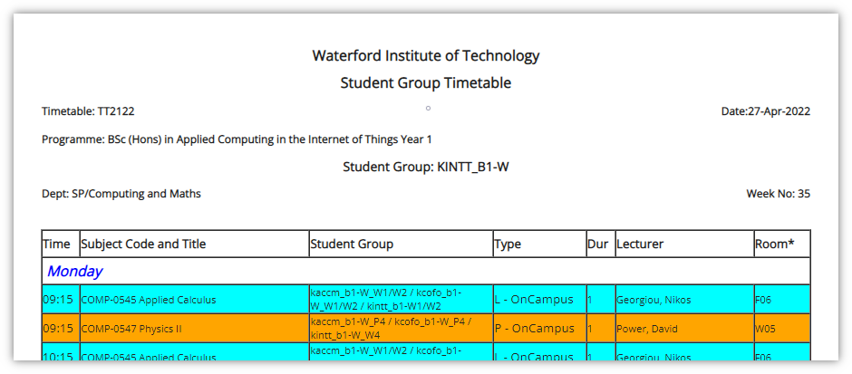

# WIT Timetable Generator



Uses [Puppeteer](https://pptr.dev/) to automatically fill out the [WIT Timetable Page](http://studentssp.wit.ie/Timetables/StudentGroupTT.aspx) and generate a screenshot and PDF of the timetable. It also sends these to a [Discord](https://discord.com/) channel using a [webhook](https://support.discord.com/hc/en-us/articles/228383668-Intro-to-Webhooks) (you can opt-out of this).

## Why?

Filling out the form every time is annoying, especially since it refreshes.

## How do I use it?

> Make sure you have [Node](https://nodejs.org/en/) installed.

* Clone the repo and `cd` into it.
* `npm i`
* Fill out your details in `.env.local.example` and rename it to `.env`
* Comment out the following line from `index.js` if you don't want to use Discord webhooks:

```js
await sendToDiscord(...)
```

* `npm run start`
* The timetable should be in the `screenshots` and `pdfs` folder.

## Resources used

* [https://stackoverflow.com/a/62892482](https://stackoverflow.com/a/62892482)
* [https://github.com/lannonbr/puppeteer-screenshot-action](https://github.com/lannonbr/puppeteer-screenshot-action)
* [https://birdie0.github.io/discord-webhooks-guide/](https://birdie0.github.io/discord-webhooks-guide/)
* [https://github.com/nektos/act/issues/588#issuecomment-1078427722](https://github.com/nektos/act/issues/588#issuecomment-1078427722)

## How do I contribute?

If it is something small, make a change directly and make a pull request.

If it is something that requires testing:

* Install [act](https://github.com/nektos/act).
* Rename `env.local.example` to `env.local`
* Run `act --secret-file .env.local workflow_dispatch` to test changes.

## License

Licensed under the MIT license.
